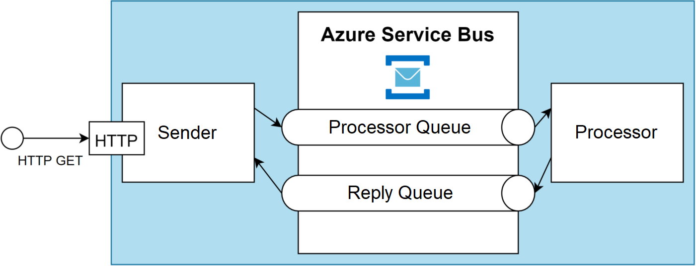

## Azure.ServiceBus.CommandBus

A Command Bus implementation using Azure Service Bus. The Command Bus is implemented using the request-reply pattern 
with the following queues:

#### Processor Queues
The processor instances will receive command messages from these queues. Processing of commands can be scaled using multiple competing consumer instances. 

Commands can be published to multiple processor queues and the queues will be automatically created if they do not exist already.

#### Reply Queue
A single reply queue is used to return the command responses to. The reply queue is session enabled so that the sender instance can retrieve the response relating to their command. 

## Performance

Latency and throughput is much worse than using fully asynchronous approaches where a response is not required. The following could be achieved with the current implementation using a Standard tier service bus:

| Metric      | Performance |
| ----------- | ----------- |
| Throughout   | 282 req/s  |
| Latency   | 101 ms  |

## Response Handling
Basic response handling has been implemented. The command bus is able to return the following responses:

| Status      | StatusCode | Description |
| ----------- | ----------- | ----------- |
| OK   | 200  | The command was successfully processed by all registered command handlers. No data can be returned because multiple handlers can be registered  |
| BadRequest   | 400  | Invalid data was provided for the command. This can be achieved by throwing a ***CommandValidationException*** within a command handler |
| InternalServerError   | 500  | There was an unhandled exception processing one of the registered command handlers |

## Extension
The message format has been kept as a string so that additional layers of abstraction can be added on top of the command bus using a format such as JSON.

An example of extending the library is shown in the **CommandBus** project. This project uses a base handler class and serializes the commands to JSON before they are send through the command bus.